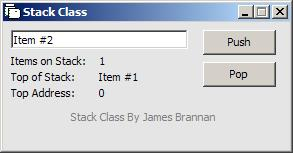



## Simulated Stack Class

### Description

This class was created for the main purposes of having a controlled "stack" (like the stack, or memory heap in a computer). It will let you push items onto the stack, pop them off, and retrieve the number of items on the stack, and more. I'm pretty much a beginner here, so tell me what you think.
 
### More Info
 
Just declare a Stack object, and you can Push and Pop values to/from the stack.

Remember to use "set x = new Stack" and "set x = nothing" in the appropriate places.

None that I'm aware of; If you do not set the ErrUnderrun flag, VB will throw an exception if you pop an item from the stack when it's empty.

             |
---                |---
**Submitted On**   |2003-02-17 01:48:24
**By**             |[TheMouse](https://github.com/Planet-Source-Code/PSCIndex/blob/master/ByAuthor/themouse.md)
**Level**          |Intermediate
**User Rating**    |4.8 (24 globes from 5 users)
**Compatibility**  |VB 6\.0
**Category**       |[String Manipulation](https://github.com/Planet-Source-Code/PSCIndex/blob/master/ByCategory/string-manipulation__1-5.md)
**World**          |[Visual Basic](https://github.com/Planet-Source-Code/PSCIndex/blob/master/ByWorld/visual-basic.md)
**Archive File**   |[Simulated\_1545762172003\.zip](https://github.com/Planet-Source-Code/themouse-simulated-stack-class__1-43290/archive/master.zip)

